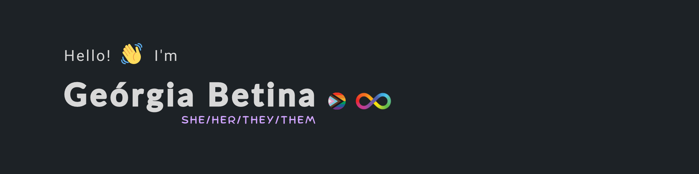

**Welcome**! It's great to have you here.
   
My name is Geórgia Betina, and I use the pronouns she/her or they/them. I'm a 24-year-old non-binary woman from Brazil, a proud member of the LGBTQAIPN+ community, and autistic. I'm currently an undergraduate student at [UDESC](https://www.udesc.br/). While I'm immersing myself in Data Science through the [Google Data Analytics Course](https://www.coursera.org/professional-certificates/google-data-analytics), I also collaborate with [LAMAN](https://github.com/GASR-UDESC), assisting in scientific research on the design of mobile robots for testing multi-robotic systems.

At the moment, I'm taking a step back to focus more on my degree.

 

:computer: :books: My lil tech stack:

:envelope_with_arrow: Reach me: [e-mail](mailto:georgia_betina@hotmail.com) | [LinkedIn](https://www.linkedin.com/in/ge%C3%B3rgia-betina/)
